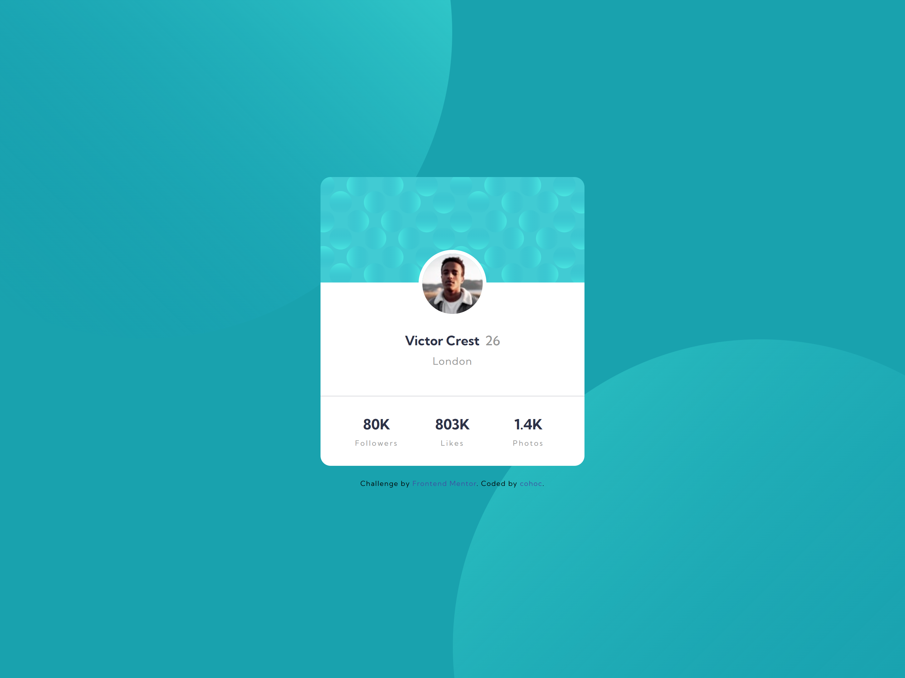
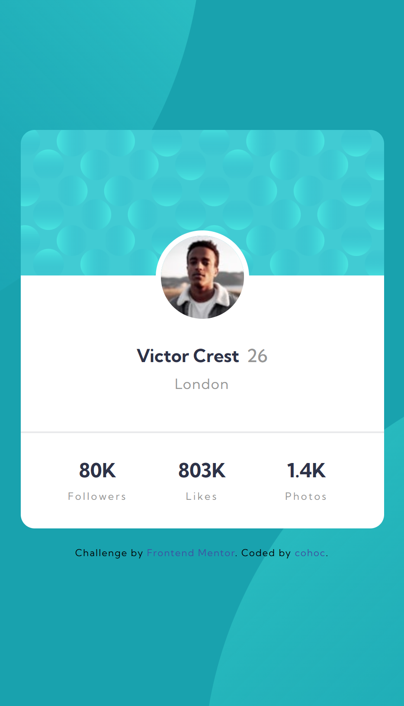

# Frontend Mentor - Profile card component solution

This is a solution to the [Profile card component challenge on Frontend Mentor](https://www.frontendmentor.io/challenges/profile-card-component-cfArpWshJ). Frontend Mentor challenges help you improve your coding skills by building realistic projects. 

## Table of contents

- [Overview](#overview)
  - [The challenge](#the-challenge)
  - [Screenshot](#screenshot)
  - [Links](#links)
- [My process](#my-process)
  - [Built with](#built-with)
  - [Useful resources](#useful-resources)

## Overview

### The challenge

- Build out the project to the designs provided

### Screenshot

### Links

- [Solution](https://www.frontendmentor.io/solutions/profile-card-PtAqPml7Vg)
- [Live Site](https://cohoc.github.io/frontendmentor/profile-card-component-main/)

## My process

### Built with

- Semantic HTML5 markup
- CSS custom properties
- Flexbox

### Useful resources

- [Background positioning](https://developer.mozilla.org/en-US/docs/Web/CSS/background-position)
- [Multiple images in background](https://www.w3schools.com/css/css3_backgrounds.asp)
- [Positioning multiple images in background](https://www.w3schools.com/css/css3_backgrounds.asp)