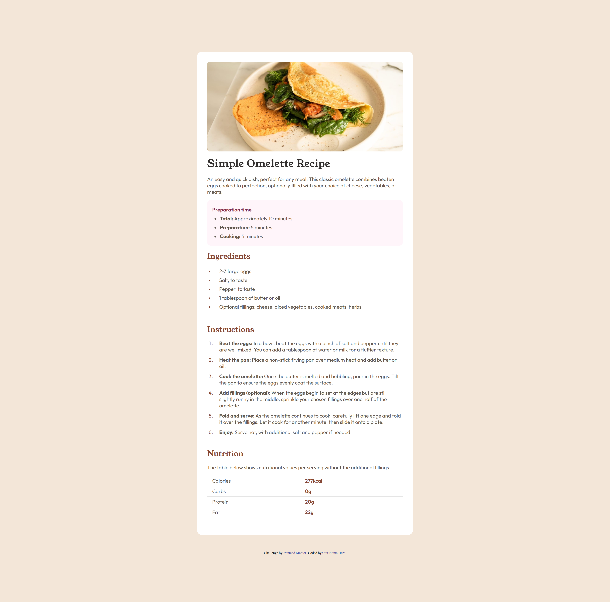

# Frontend Mentor - Recipe page solution

This is a solution to the [Recipe page challenge on Frontend Mentor](https://www.frontendmentor.io/challenges/recipe-page-KiTsR8QQKm). Frontend Mentor challenges help you improve your coding skills by building realistic projects. 

## Table of contents

- [Overview](#overview)
  - [Screenshot](#screenshot)
  - [Links](#links)
- [My process](#my-process)
  - [Built with](#built-with)
  - [Resources](#useful-resources)

## Overview
Recipe page is an easy level challenge with a heavier focus on list styling and some mobile responsiveness.

### Screenshot

</img>

</img>

### Links

- [Solutions on frontendmentor](https://www.frontendmentor.io/profile/cohoc)
- [Live Site](https://cohoc.github.io/frontendmentor/recipe-page-main/)

## My process

### Built with

- Semantic HTML5 markup
- CSS custom properties
- Flexbox

### Useful resources

- [Styling lists in css](https://developer.mozilla.org/en-US/docs/Learn/CSS/Styling_text/Styling_lists)

