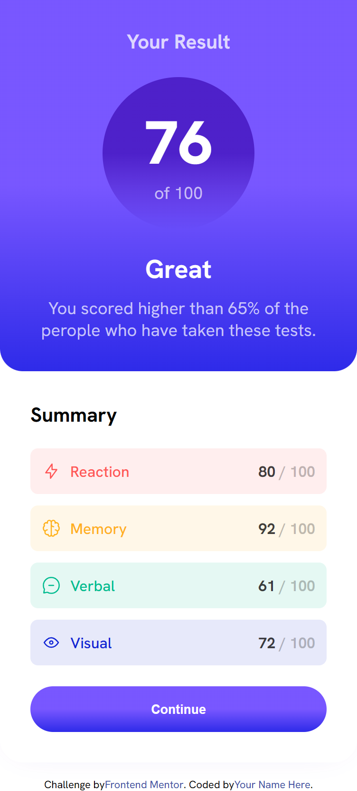
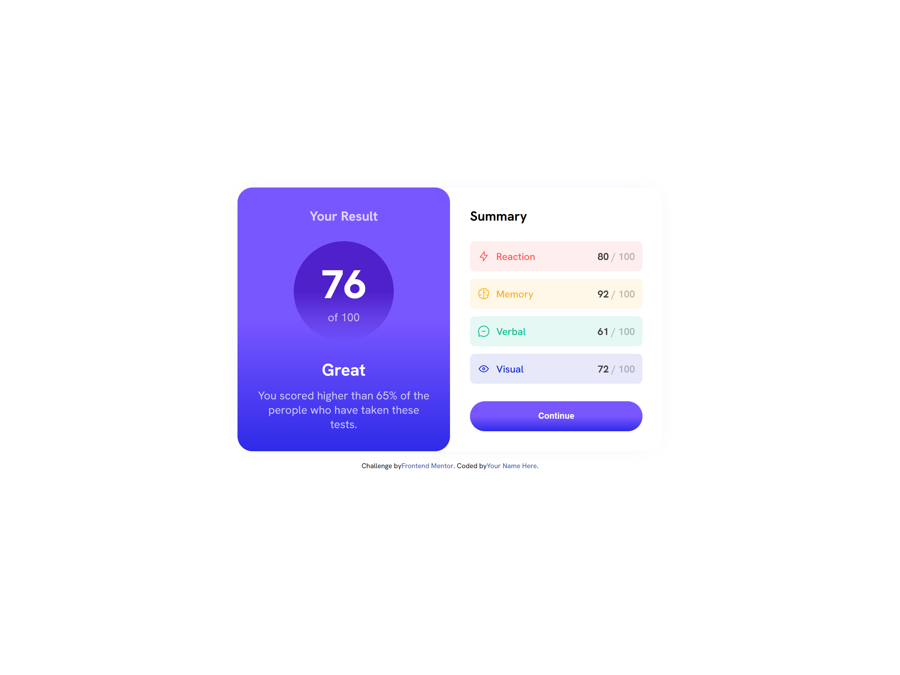

# Frontend Mentor - Results summary component solution

This is a solution to the [Results summary component challenge on Frontend Mentor](https://www.frontendmentor.io/challenges/results-summary-component-CE_K6s0maV). Frontend Mentor challenges help you improve your coding skills by building realistic projects. 

## Table of contents

- [Overview](#overview)
  - [The challenge](#the-challenge)
  - [Screenshot](#screenshot)
  - [Links](#links)
- [My process](#my-process)
  - [Built with](#built-with)
 

## Overview

### The challenge

Users should be able to:

- View the optimal layout for the interface depending on their device's screen size
- See hover and focus states for all interactive elements on the page
- **Bonus**: Use the local JSON data to dynamically populate the content

### Screenshot

</img>
</img>

### Links

- [Solution](https://www.frontendmentor.io/solutions/results-summary-component-using-html-css-json-and-js-I_ITg2MON5)
- [Live Site](https://cohoc.github.io/frontendmentor/results-summary-component-main/)

## My process

### Built with

- HTML5 markup
- CSS custom properties
- Flexbox
- JSON
- JS

