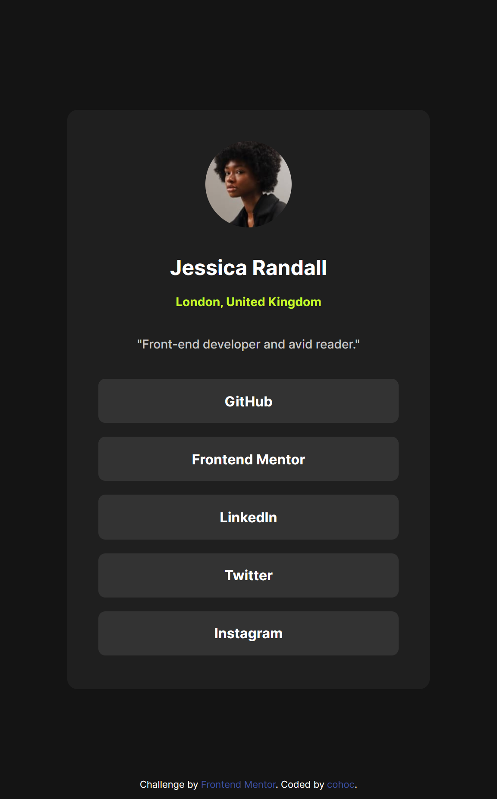
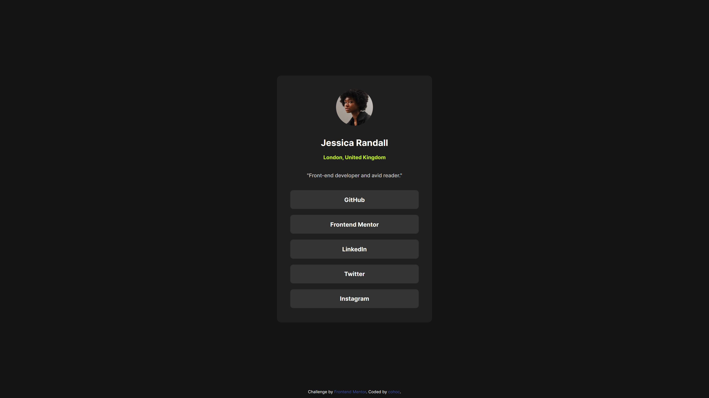

# Frontend Mentor - Social links profile solution

This is a solution to the [Social links profile challenge on Frontend Mentor](https://www.frontendmentor.io/challenges/social-links-profile-UG32l9m6dQ). Frontend Mentor challenges help you improve your coding skills by building realistic projects. 

## Table of contents

- [Overview](#overview)
  - [Screenshot](#screenshot)
  - [Links](#links)
- [My process](#my-process)
  - [Built with](#built-with)
  - [What I learned](#what-i-learned)
  - [Useful resources](#useful-resources)

## Overview
Social Links Profile is an easier challenge that features aesthetic links with small animations.

### Screenshot

</img>

</img>

### Links

- [Solutions on frontendmentor](https://www.frontendmentor.io/home)
- [Live Site](https://cohoc.github.io/frontendmentor/social-links-profile-main/)

## My process

### Built with

- Semantic HTML5 markup
- CSS custom properties
- Flexbox

### What I learned

This challenge features a locally installed font, Inter and learning how to use this font locally with 
@font-face was something new I learned.

### Useful resources

- [how to use @font-face in css](https://css-tricks.com/snippets/css/using-font-face-in-css/)