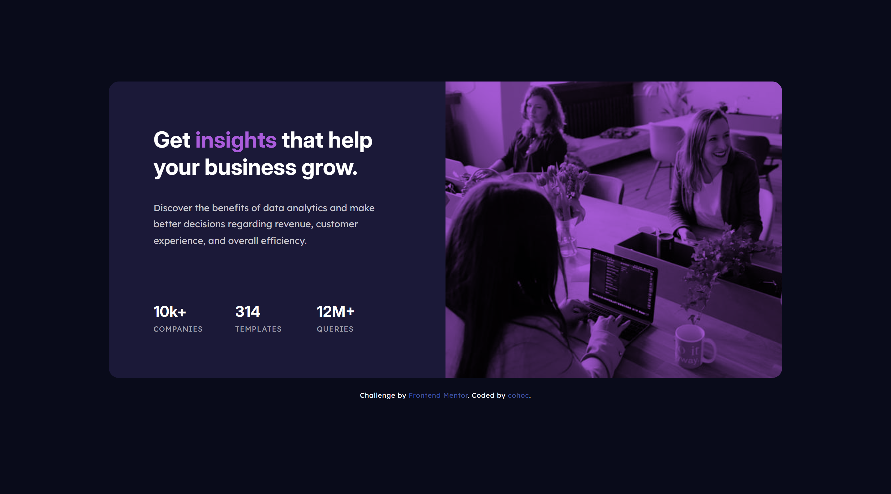
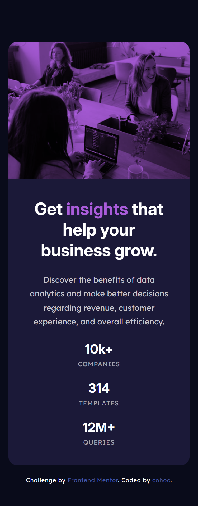

# Frontend Mentor - Stats preview card component solution

This is a solution to the [Stats preview card component challenge on Frontend Mentor](https://www.frontendmentor.io/challenges/stats-preview-card-component-8JqbgoU62). Frontend Mentor challenges help you improve your coding skills by building realistic projects. 

## Table of contents

- [Overview](#overview)
  - [The challenge](#the-challenge)
  - [Screenshot](#screenshot)
  - [Links](#links)
- [My process](#my-process)
  - [Built with](#built-with)
 
## Overview

### The challenge

Users should be able to:

- View the optimal layout depending on their device's screen size

### Screenshot

 

### Links

- [Solution URL](https://www.frontendmentor.io/solutions/stats-preview-card-WfP2pmW-mE)
- [Live Site URL](https://cohoc.github.io/frontendmentor/stats-preview-card-component-main/)

## My process

### Built with

- Semantic HTML5 markup
- CSS custom properties
- Flexbox
